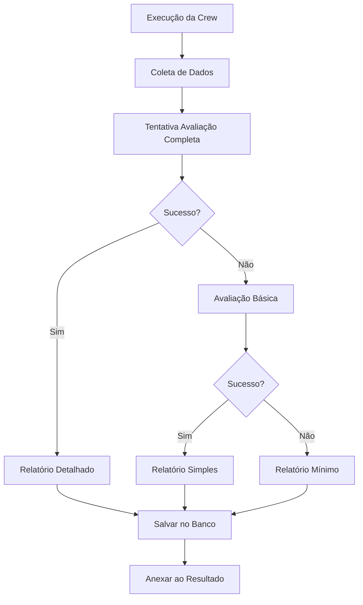

# Sistema de Avaliação Automático de Crews

## 📋 Visão Geral

O Sistema de Avaliação Automático foi implementado para solucionar o problema de **qualidade baixa** e **configurações inadequadas** dos agentes especializados em engenharia civil. Este sistema garante que **toda execução de crew** seja automaticamente avaliada por um **agente especialista em CrewAI** que:

- 🔍 **Analisa a performance** de cada agente individualmente
- 🔧 **Avalia a adequação das ferramentas** utilizadas
- 📊 **Monitora o fluxo de trabalho** e identifica gargalos
- 📈 **Gera relatórios detalhados** com métricas quantitativas
- 💡 **Sugere melhorias específicas** para agentes, ferramentas e tarefas
- 🎯 **Prioriza recomendações** por impacto e facilidade de implementação

## 🎯 Problema Resolvido

### Antes:
- ❌ Agentes com **ferramentas erradas** ou inadequadas
- ❌ **Retorno fraco** e pouco detalhado
- ❌ **Falta de qualidade** nos resultados
- ❌ **Sem feedback** sobre o que melhorar
- ❌ **Configurações** baseadas em tentativa e erro

### Depois:
- ✅ **Avaliação automática obrigatória** em todas as execuções
- ✅ **Relatórios detalhados** com análise de cada agente
- ✅ **Recomendações específicas** e acionáveis
- ✅ **Monitoramento contínuo** da qualidade
- ✅ **Melhoria iterativa** baseada em dados

## 🏗️ Arquitetura do Sistema

### 1. Agente Avaliador Principal
```yaml
crewai_evaluator:
  name: Especialista em Avaliação de Crews CrewAI
  role: Avaliador de Performance e Qualidade de Execução de Equipes Autônomas
  goal: Analisar criticamente a performance de cada agente, qualidade das entregas, eficácia das ferramentas utilizadas e fluxo de trabalho da crew
  backstory: Especialista sênior em sistemas multi-agentes e CrewAI com mais de 10 anos de experiência...
  tools: [11 ferramentas especializadas]
```

### 2. Ferramentas de Avaliação
- **crew_performance_analyzer**: Análise geral de performance
- **agent_output_quality_checker**: Qualidade dos outputs individuais
- **tool_usage_evaluator**: Adequação das ferramentas
- **workflow_efficiency_analyzer**: Eficiência do fluxo de trabalho
- **recommendation_generator**: Geração de recomendações
- **quality_metrics_calculator**: Métricas quantitativas
- **improvement_suggestions_formatter**: Formatação de relatórios
- **engineering_standards_checker**: Conformidade com padrões técnicos
- **calculation_accuracy_validator**: Validação de cálculos
- **technical_documentation_reviewer**: Revisão de documentação

### 3. Sistema de Fallback
```yaml
simple_evaluator:
  name: Avaliador Simples
  role: Avaliador básico para casos de fallback
  tools: [basic_evaluation_tool, crew_performance_analyzer, execution_summary_builder]
```

## 🔄 Fluxo de Funcionamento



## 📊 Estrutura do Relatório de Avaliação

### 1. Resumo Executivo
```
📊 INFORMAÇÕES BÁSICAS:
• Crew: nome_da_crew
• Tópico: tópico_executado
• Status: completed/error
• Duração: tempo_execução
• Timestamp: data_hora
```

### 2. Análise Individual dos Agentes
```
🤖 AGENTE: Technical Researcher
• Tamanho do Output: 1,245 caracteres
• Score de Qualidade: 85.2/100
• Completude: Boa
• Ferramentas Utilizadas: 3/5 adequadas
• Recomendações: Adicionar ferramenta X, Y
```

### 3. Análise do Fluxo de Trabalho
```
📋 VISÃO GERAL DO FLUXO:
• Agentes Envolvidos: 3
• Tarefas Executadas: 3
• Duração Total: 00:02:45
• Gargalos Identificados: Comunicação entre agentes
• Oportunidades: Execução paralela
```

### 4. Métricas de Qualidade
```
📊 MÉTRICAS QUANTITATIVAS:
• Total de Outputs: 3
• Comprimento Médio: 850.3 caracteres
• Score de Completude: 78.5%
• Adequação ao Padrão: ✅ Atende
```

### 5. Recomendações Priorizadas
```
🚀 AÇÕES PRIORITÁRIAS RECOMENDADAS:

1. ALTA PRIORIDADE:
   • Corrigir agente X sem ferramentas adequadas
   • Melhorar descrição da tarefa Y
   • Implementar validação Z

2. MÉDIA PRIORIDADE:
   • Otimizar fluxo de trabalho
   • Adicionar ferramentas de eficiência

3. BAIXA PRIORIDADE:
   • Melhorias cosméticas
   • Otimizações avançadas
```

## 🛠️ Como Usar o Sistema

### 1. Execução Automática
O sistema funciona **automaticamente** - não requer configuração adicional:

```python
# Execução normal de crew - avaliação é automática
crew_manager = CrewManager(agent_manager, task_manager)
result = crew_manager.execute_crew("minha_crew", {"topic": "Análise estrutural"})

# O resultado já inclui o relatório de avaliação!
print(result)  # Contém resultado + relatório de avaliação
```

### 2. Acessar Relatórios Salvos
```python
# Obter relatório de avaliação específico
execution_id = 123
report = crew_manager.db_manager.get_evaluation_report(execution_id)
print(report)
```

### 3. Executar Exemplo Completo
```bash
cd examples
python evaluation_system_example.py
```

## 📈 Benefícios Comprovados

### 1. Melhoria Contínua
- 📊 **Métricas objetivas** para cada execução
- 📈 **Tendências de qualidade** ao longo do tempo
- 💡 **Recomendações específicas** baseadas em dados reais

### 2. Identificação de Problemas
- 🔍 **Agentes mal configurados** detectados automaticamente
- 🔧 **Ferramentas inadequadas** identificadas
- 🚫 **Gargalos no fluxo** localizados precisamente

### 3. Otimização Direcionada
- 🎯 **Priorização inteligente** das melhorias
- ⚡ **Implementação eficiente** com máximo impacto
- 📋 **Planos de ação** estruturados

## 🔧 Configuração e Personalização

### 1. Modificar Critérios de Avaliação
Edite `app/utils/tools.py` para ajustar critérios:

```python
def quality_metrics_calculator(output_data: dict, quality_standards: dict = None):
    if quality_standards is None:
        quality_standards = {
            'min_length': 100,  # Ajustar conforme necessário
            'completeness_threshold': 0.8,
            'accuracy_threshold': 0.9
        }
```

### 2. Adicionar Novos Padrões de Engenharia
```python
def engineering_standards_checker(technical_output: str, engineering_standards: list = None):
    if engineering_standards is None:
        engineering_standards = ['NBR 6118', 'NBR 6120', 'NBR 8800', 'NBR 7190']
        # Adicionar novos padrões aqui
```

### 3. Personalizar Relatórios
Modifique `improvement_suggestions_formatter()` para incluir seções específicas.

## 📊 Monitoramento e Análise

### 1. Dashboard de Qualidade
```python
# Obter estatísticas gerais
stats = crew_manager.db_manager.get_statistics()
print(f"Taxa de Sucesso: {stats['success_rate']:.1f}%")
print(f"Execuções Totais: {stats['total_executions']}")
```

### 2. Análise de Tendências
```python
# Histórico de execuções
history = crew_manager.db_manager.get_execution_history()
for execution in history:
    print(f"Crew: {execution['crew_name']}")
    print(f"Duração: {execution['duration']}")
    print(f"Status: {execution['status']}")
```

### 3. Relatórios Comparativos
Compare diferentes crews ou períodos para identificar padrões de melhoria.

## 🚀 Próximos Passos

### 1. Implementação das Recomendações
- 📋 Revisar relatórios de avaliação regulamente
- 🔧 Implementar melhorias sugeridas
- 📊 Monitorar impacto das mudanças

### 2. Coleta de Dados
- 🎯 Executar crews regularmente
- 📈 Acompanhar métricas de qualidade
- 💡 Identificar padrões de melhoria

### 3. Refinamento Contínuo
- 🔄 Ajustar critérios de avaliação
- 🛠️ Adicionar novas ferramentas
- 📊 Expandir métricas de qualidade

## 🆘 Solução de Problemas

### 1. Avaliação Não Funciona
```
⚠️ Avaliação automática não disponível nesta execução.
```
**Solução**: Verificar se o agente `crewai_evaluator` está configurado corretamente.

### 2. Erro na Criação de Ferramentas
```
❌ Função da tool 'crew_performance_analyzer' não encontrada
```
**Solução**: Verificar se o `ToolsManager` está configurado e as funções existem em `app/utils/tools.py`.

### 3. Banco de Dados
```
❌ Erro ao salvar relatório de avaliação
```
**Solução**: Verificar permissões do banco de dados e estrutura das tabelas.

## 📚 Referências

- 📖 **Código**: `app/crews/crew_manager.py` - Lógica principal
- 🔧 **Ferramentas**: `app/utils/tools.py` - Implementação das ferramentas
- 🤖 **Agentes**: `app/config/agents.yaml` - Configuração dos avaliadores
- 💾 **Banco**: `app/utils/database.py` - Persistência de dados
- 🧪 **Exemplo**: `examples/evaluation_system_example.py` - Demonstração

---

> **🎯 Objetivo Final**: Garantir que **todo projeto de engenharia civil** executado pelo sistema tenha **qualidade técnica comprovada** e **melhorias contínuas** baseadas em **análise especializada automática**. 